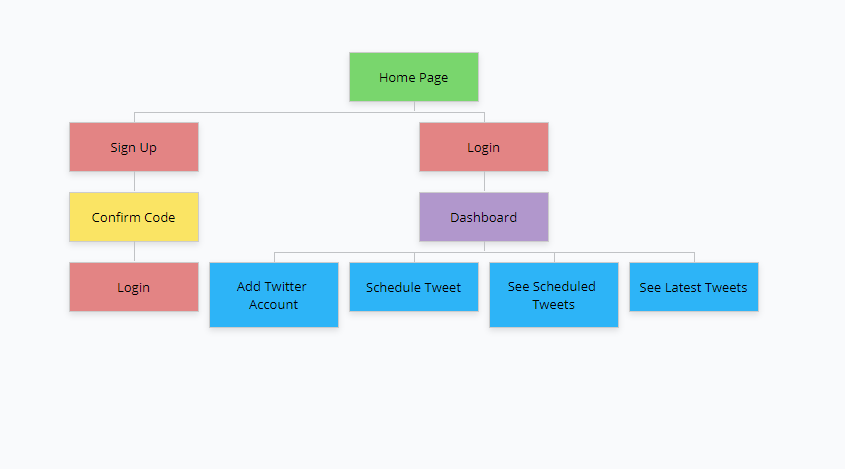

# Tweeto 

## Overview
<p>Our backend server intends to serve as an API that allows users to tweet at a later time. Users will have the capability of setting what day/time a tweet should be sent and they have the option to delete that queued tweet before the deadline. Users have the option to schedule multiple tweets. We've also included the option to upload images as well. For power-users who have multiple twitter accounts to manage, we've given them the ability to register additional accounts.</p>

## Getting Started

There is quite a bit of setup before we can get this server fully running. We'll be interacting with AWS as well as the Twitter APIs. Certain services need to be configured and keys need to be collected. Please follow each setup carefully before running this server. 

### FOR SERVER ADMINISTRATORS - AWS Setup

#### AWS Access Keys

Contact your AWS System Administrator in order to receive these keys. They will be used in the `.env` file.

#### DynamoDB

We'll need two tables `users` and `scheduledTweets`. Please ensure you have the following setup for each of your tables

<ul>
  <li> TableName - "users" </li>
    <ul>
      <li> Partition Key - "email"</li>  
      <li> Sort Key - "twitterID"</li>
    </ul>
  <li> TableName - "scheduledTweets" </li>
    <ul>
      <li> Partition Key - "email"</li>  
      <li> Sort Key - "uuid"</li>
    </ul>
</ul>

#### S3

We'll need two buckets `tweeto-images` and `tweeto-images-public`

`tweeto-images` doesn't require any special setup

`tweeto-images-public` must be public

- Make sure all settings are turned off for blocking public access under permissions. 

- Under Bucket policy of permissions use the following policy
```json
{
    "Version": "2012-10-17",
    "Statement": [
        {
            "Sid": "AllowPublicRead",
            "Effect": "Allow",
            "Principal": {
                "AWS": "*"
            },
            "Action": "s3:GetObject",
            "Resource": "arn:aws:s3:::tweeto-images-public/*"
        }
    ]
}
```

#### Cognito

For cognito, under attributes make sure you select Email address or phone number and allow email addresses. Check enable case sensitivity for username input. Leave the rest as default.

Under App clients set up a new App client in order to acquire a `CLIENT_ID` and `CLIENT_SECRET` which are used in our `.env` file mentioned below.

### FOR SERVER ADMINISTRATORS - `.env` Setup
Store this `.env` file in the same directory level as `app.py`

```python
USER_POOL_ID=Get_this_from_Cognito
CLIENT_ID=Get_this_from_Cognito
CLIENT_SECRET=Get_this_from_Cognito
AWS_ACCESS_KEY_ID=Get_this_from_AWS
AWS_SECRET_ACCESS_KEY=Get_this_from_AWS
REGION_NAME=Get_this_from_AWS
```

### FOR SERVER - ADMINISTRATORS - Downloading repo, installing dependencies and running application

<i>Windows 10 Instructions Using Git Bash
  
  Please note some variables may be specific to your machine such as "python"</i>
```console
git clone "https://github.com/webservertweeto/backend.git"
cd backend/
python -m venv env
. env/Scripts/activate
pip install -r requirements.txt
export FLASK_APP=app.py
flask run
```

### FOR USERS - Setup Twitter Developer Account and App (Requirements)
<p>Before you get started you need to have a valid <strong>Twitter API key</strong>(Consumer Key), <strong>API secret key</strong>(Consumer Secret key), <strong>Access token</strong>, <strong>Access token secret</strong>. We will be tweeting your scheduled tweets on your behalf; therefore, we'll need this information beforehand.
</p>
<ol>
  <li> Create a twitter account if you do not already have one. </li>
  <li> <a href="https://developer.twitter.com/en/apply/user"> Apply for a twitter developer account. </a> </li>
  <li> Enter phone number if you don't have one associated with your twitter.</li>
  <li> Add account details. Click on continue. </li>
  <li> Describe in your own words what you are building. Click on continue.</li>
  <li> Submit application. </li>
  <li> Check your email associated with your twitter and click Confirm your email. </li>
  <li> On the welcome screen, click on Create an app. </li>
  <li> First, click on your <strong>API key</strong> and <strong>API secret key</strong>. Second, click on create to get <strong>Access access token</strong> and <strong>access token secret</strong>. </li>
  <li> Click App permissions Edit button and enable <strong>Read, write and access Direct Messages</strong>. </li>
</ol>


## Requirements

### Python Version
- Python 3.8.5

### Dependencies 
- APScheduler==3.6.3
- boto3==1.16.30
- botocore==1.19.30
- certifi==2020.12.5
- chardet==3.0.4
- click==7.1.2
- Flask==1.1.2
- idna==2.10
- itsdangerous==1.1.0
- Jinja2==2.11.2
- jmespath==0.10.0
- MarkupSafe==1.1.1
- oauthlib==3.1.0
- PySocks==1.7.1
- python-dateutil==2.8.1
- python-dotenv==0.15.0
- pytz==2020.4
- requests==2.25.0
- requests-oauthlib==1.3.0
- s3transfer==0.3.3
- six==1.15.0
- tweepy==3.9.0
- tzlocal==2.1
- urllib3==1.26.2
- Werkzeug==1.0.1


## Data Model


The application will provide several pieces of data: user data, token data, and scheduled tweets.
  
- A user can have many accounts
- Scheduled tweets are a list of tweets that the front-end can use to mock the tweet prior to it being sent. 
- Token data is provided when a user signs in

#### User

```javascript
{
      "AWSusername": "9d8cae38-38dd-4e54-9521-9d4ee47ffa22e",
      "email": "johnsmith@gmail.com",
      "name": "John Smith",
      "twitterAccounts": [
          {
              "accessTokenKey": "9d8cae38-38dd-4e54-9521-9d4ee47ffa22e",
              "accessTokenSecret": "9d8cae38-38dd-4e54-9521-9d4ee47ffa22e",
              "consumerKey": "9d8cae38-38dd-4e54-9521-9d4ee47ffa22e",
              "consumerSecret": "9d8cae38-38dd-4e54-9521-9d4ee47ffa22e",
              "dateJoined": "12/9/2020",
              "twitterFullName": "John Smith",
              "twitterHandle": "SmithJohnny",
              "twitterID": "9d8cae38-38dd-4e54-9521-9d4ee47ffa22e",
              "twitterProfilePicture": "http://pbs.twimg.com/profile_images/9d8cae38-38dd-4e54-9521-9d4ee47ffa22e/9d8cae38-38dd-4e54-9521-9d4ee47ffa22e.jpg",
              "twitterProfilePictureHttps": "https://pbs.twimg.com/profile_images/9d8cae38-38dd-4e54-9521-9d4ee47ffa22e/9d8cae38-38dd-4e54-9521-9d4ee47ffa22e.jpg"
          }
      ]
}
```

#### Scheduled Tweets

```javascript
{
    "Data": [
        {
            "tweetImageLink": "https://tweeto-images-public.s3.amazonaws.com/9d8cae38-38dd-4e54-9521-9d4ee47ffa22e.jpg",
            "tweetText": "Hello 123!",
            "tweetTime": "2020-12-10 12:32:10",
            "twitterFullName": "John Smith
            "twitterHandle": "SmithJoy"
            "twitterID": "9d8cae38-38dd-4e54-9521-9d4ee47ffa22e",
            "twitterProfilePicture": "http://pbs.twimg.com/profile_images/9d8cae38-38dd-4e54-9521-9d4ee47ffa22e.jpg",
            "twitterProfilePictureHttps": "https://pbs.twimg.com/profile_images/9d8cae38-38dd-4e54-9521-9d4ee47ffa22e.jpg",
            "uuid": "9d8cae38-38dd-4e54-9521-9d4ee47ffa22e"
        },
        {
            "tweetImageLink": "",
            "tweetText": "I love coding!",
            "tweetTime": "2020-12-10 12:32:10",
            "twitterFullName": "John Smith2"
            "twitterHandle": "SmithJohnny"
            "twitterID": "9d8cae38-38dd-4e54-9521-9d4ee47ffa22e",
            "twitterProfilePicture": "http://pbs.twimg.com/profile_images/9d8cae38-38dd-4e54-9521-9d4ee47ffa22e.jpg",
            "twitterProfilePictureHttps": "https://pbs.twimg.com/profile_images/9d8cae38-38dd-4e54-9521-9d4ee47ffa22e.jpg",
            "uuid": "9d8cae38-38dd-4e54-9521-9d4ee47ffa22e"
        }
    ]
}
```


#### Token

```javascript
{
  "access_token": "9d8cae38-38dd-4e54-9521-9d4ee47ffa22e"",
  "id_token": "9d8cae38-38dd-4e54-9521-9d4ee47ffa22e"",
  "refresh_token": "9d8cae38-38dd-4e54-9521-9d4ee47ffa22e""
}
```

## Site map


## User Stores or Use Cases

<ul>
  <li> As a non-registered user, I can create a new account on the site.</li>

  <li> As a user, register a twitter account to my Tweeto account.</li>
  <li> As a user, deregister a twitter account from my Tweeto account.</li>
  <li> As a user, schedule a tweet. These tweets can consist of a text, image or both.</li>
  <li> As a user, delete a scheduled tweet.</li>
  <li> As a user, view my scheduled tweets.</li>
  <li> As a user, view my latest tweets.</li>
  <li> As a user, view my registered accounts.</li>
</ul>


## References Used
<p><a href="https://developer.twitter.com/en/portal/dashboard">Twitter Developers</a> - Twitter Developer Tool </p>
<p> <a href="http://docs.tweepy.org/en/latest/">Tweepy</a> - Tweepy Documentation </p>
<p> <a href="https://boto3.amazonaws.com/v1/documentation/api/latest/index.html">AWS</a> - Boto3 Documentation </p>

## Contributors

| Name          | Github        | 
| ------------- | ------------- | 
| Jorge Quiroz  | <a href="https://github.com/JQuiroz728">@JQuiroz728</a>  | 
| Arun Ajay  | <a href="https://github.com/arun-ajay">@arun-ajay</a>  |
| Jiseon Yu | <a href="https://github.com/JiseonYu">@JiseonYu</a> | 

